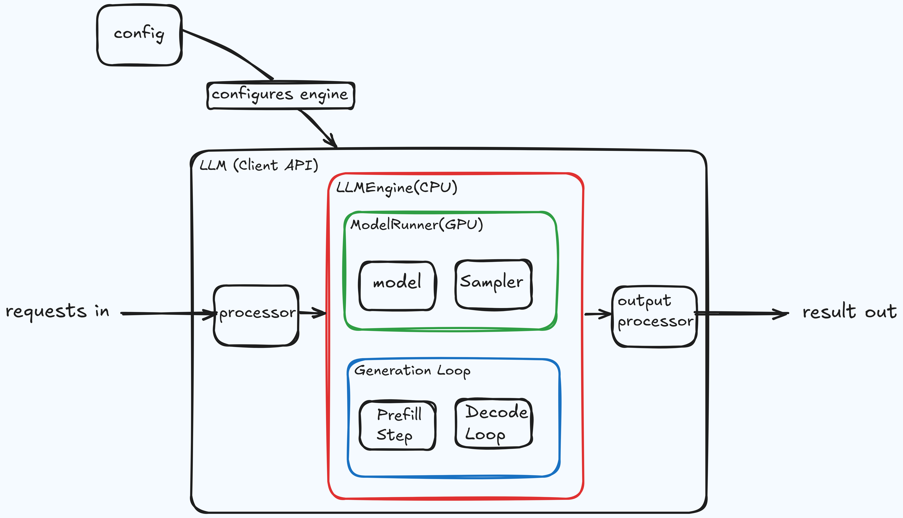

# llm-inference


Minimal, high-performance LLM inference engine built from scratch in pure PyTorch.
## Architecture




## Installation

```bash
# Install uv package manager
curl -LsSf https://astral.sh/uv/install.sh | sh

# Sync dependencies
uv sync --extra bench
source .venv/bin/activate

# Download model weights (Qwen3-0.6B)
hf download Qwen/Qwen3-0.6B --local-dir ./Qwen3-0.6B/
```

## Benchmarks

Benchmarked on **NVIDIA L4 (24 GB)** (Prompt length 128, max tokens 256, greedy decoding).

### Performance

```bash
python -m bench.perf
```

```text
Qwen3-0.6B | 596M params | torch.bfloat16 | cuda
  28L / 16H / 128D | loaded in 10.9s | 1.13 GB VRAM

Warmup...

Benchmark
Prompt length: 128 | Max tokens: 256

Batch | Time (s) | TTFT (s) | TPOT (s) | VRAM (GB) |    TPS
------------------------------------------------------------
    1 |    9.318 |    0.045 |    0.036 |     1.184 |   27.5
    4 |    9.303 |    0.051 |    0.036 |     1.323 |  110.1
    8 |    9.241 |    0.044 |    0.036 |     1.505 |  221.6
   16 |    9.327 |    0.078 |    0.036 |     1.873 |  439.2
   32 |    9.591 |    0.194 |    0.037 |     2.609 |  854.2
   64 |    9.897 |    0.485 |    0.037 |     4.079 | 1655.5
  128 |   10.338 |    1.080 |    0.036 |     7.021 | 3169.8
  256 |   14.802 |    2.175 |    0.049 |    12.904 | 4427.4
```

### Correctness

Sliding-window perplexity on WikiText-2 test set vs. Hugging Face reference:

```bash
python -m bench.ppl
```

```text
>> hf ppl: 18.1799
>> model ppl: 18.1612
difference: 0.018715
relative: 0.1029%
```
